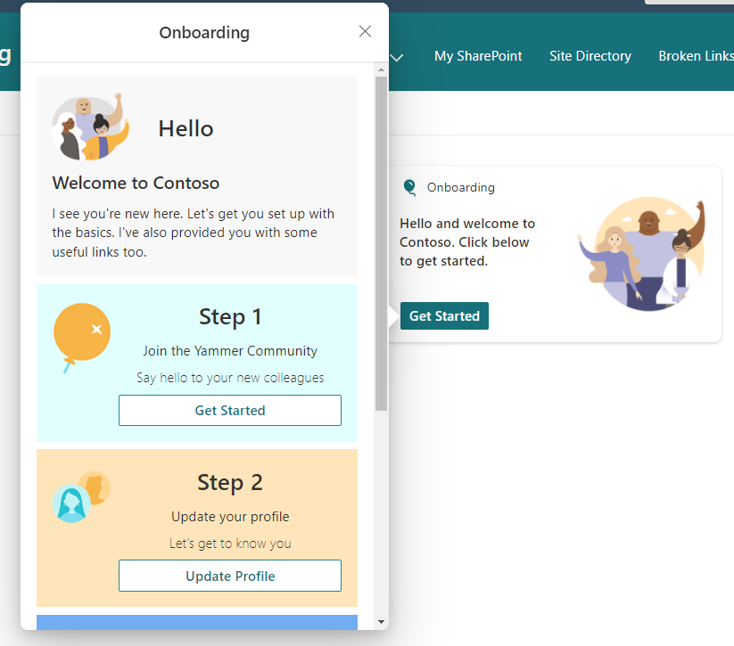
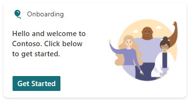

# Employee Onboarding

## Summary

Simple card designed for employee onboarding. The idea is to audience target the card at a specific group which new joiners would be added to.

There are 3 steps and 4 useful links defined in the JSON for you to customize/add your own.

The Data JSON option has been leveraged to enable users without advanced knowledge of JSON to easily add onboarding activies and links to the card.

Users can simply update the data JSON to change the display.

## Compatibility

## Designer

    

## Disclaimer
**THIS CODE IS PROVIDED *AS IS* WITHOUT WARRANTY OF ANY KIND, EITHER EXPRESS OR IMPLIED, INCLUDING ANY IMPLIED WARRANTIES OF FITNESS FOR A PARTICULAR PURPOSE, MERCHANTABILITY, OR NON-INFRINGEMENT.**

## Minimal Path to Awesome

This design was created for the Viva Connections dashboard and is designed to be used with a Card Designer card.

Steps to configure this card with *Card designer* as follows:

- Add **Card designer** to the Viva Connections Dashboard
- **Template Type** - Image
- **Card size** - Large
- **Title** - *Onboarding*
- **Icon** - Icon with the preferred selection
- **Heading** - *Hello and welcome to [CompanyName]. Click below to get started.*
- **Image** - Upload the *employee-onboarding.png* image from the assets folder
- **Card action** - Show the quick view
- **Primary Button** - On
- **Primary Button Title** - *Get Started*
- **Primary Button Action** - Show the quick view
- **Secondary Button** - Off
- **Template JSON** - Paste in the content of the *onboarding-qv-json* file
- **Data JSON** - Paste in the content of the *onboarding-data-json* file
- Audience target the card to your new joiners group