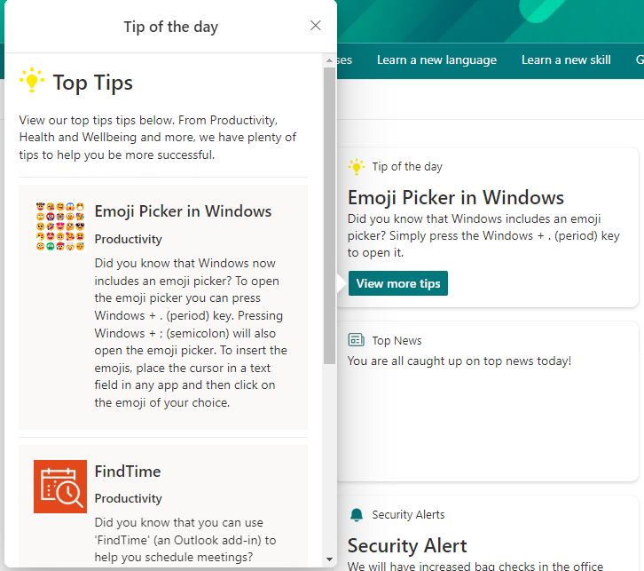
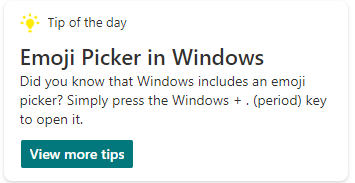

# Security Alert

## Summary

Simple card designed to show a tip of the day/top tips. 

The Data JSON option has been leveraged to enable users without advanced knowledge of JSON to easily add tips to the card. 

Users can simply update the data JSON to change the details of the tips. 

A single actionset button has been added to the quick view to link to a page with all tips e.g. a SharePoint page, SharePoint list or Microsoft Lists list. 

## Compatibility

## Designer

    

## Disclaimer
**THIS CODE IS PROVIDED *AS IS* WITHOUT WARRANTY OF ANY KIND, EITHER EXPRESS OR IMPLIED, INCLUDING ANY IMPLIED WARRANTIES OF FITNESS FOR A PARTICULAR PURPOSE, MERCHANTABILITY, OR NON-INFRINGEMENT.**

## Minimal Path to Awesome

This design was created for the Viva Connections dashboard and is designed to be used with a Card Designer card.

Steps to configure this card with *Card designer* as follows:

- Add **Card designer** to the Viva Connections Dashboard
- **Template Type** - Description
- **Card size** - Large
- **Title** - *Tip of the day*
- **Icon** - Use the icon provided with this sample [icon.png](assets/icon.png)
- **Heading** - *Name of your tip* e.g. Emoji Picker in Windows
- **Description** - *Description of your tip* e.g. "Did you know that Windows includes an emoji picker? Simply press the Windows + . (period) key to open it." 
- **Card action** - Show the quick view
- **Primary Button** - On
- **Primary Button Title** - *View more tips*
- **Primary Button Action** - Show the quick view
- **Secondary Button** - Off
- **Template JSON** - Paste in the content of the *toptips-qv-json* file
- **Data JSON** - Paste in the content of the *toptips-data-json* file
