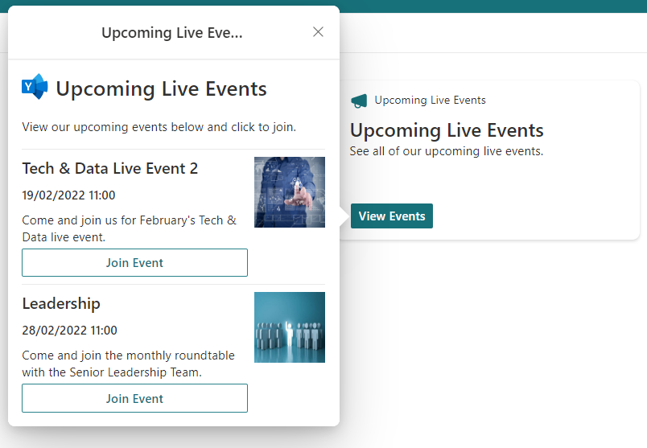
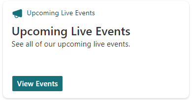

# Event schedule and registration

## Summary

Simple card designed to show a list of upcoming organisation Yammer live events.

The Data JSON option has been leveraged to enable users without advanced knowledge of JSON to easily add event items to the card. 

Users can simply update the data JSON to change the events listed and easily add more.

## Compatibility

## Designer

    

## Disclaimer
**THIS CODE IS PROVIDED *AS IS* WITHOUT WARRANTY OF ANY KIND, EITHER EXPRESS OR IMPLIED, INCLUDING ANY IMPLIED WARRANTIES OF FITNESS FOR A PARTICULAR PURPOSE, MERCHANTABILITY, OR NON-INFRINGEMENT.**

## Minimal Path to Awesome

This design was created for the Viva Connections dashboard and is designed to be used with a Card Designer card.

Steps to configure this card with *Card designer* as follows:

- Add **Card designer** to the Viva Connections Dashboard
- **Template Type** - Description
- **Card size** - Large
- **Title** - *Upcoming Live Events*
- **Icon** - Icon with the preferred selection
- **Heading** - *Upcoming Live Events*
- **Description** - See all of our upcoming live events. 
- **Card action** - Show the quick view
- **Primary Button** - On
- **Primary Button Title** - *View Events*
- **Primary Button Action** - Show the quick view
- **Secondary Button** - Off
- **Template JSON** - Paste in the content of the *liveevents-qv-json* file
- **Data JSON** - Paste in the content of the *liveevents-data-json* file
